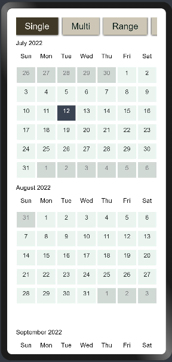
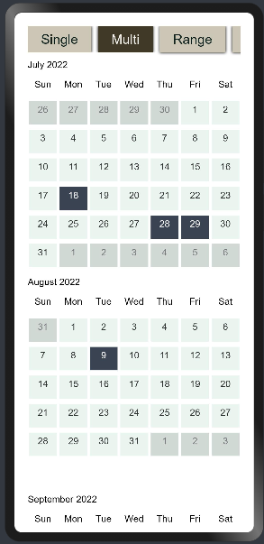
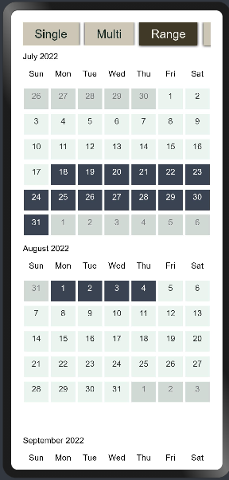
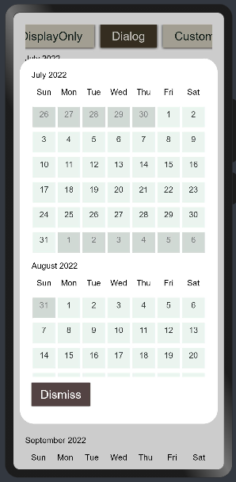
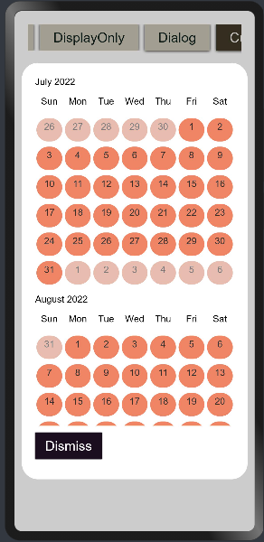
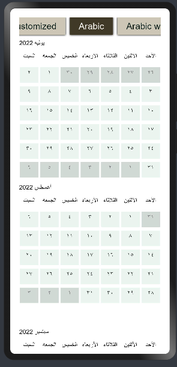
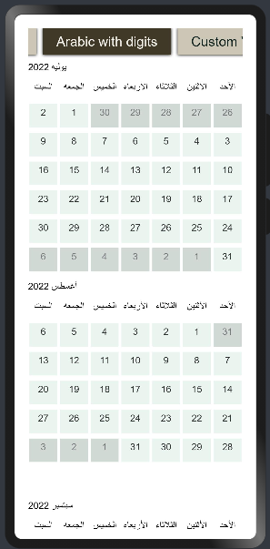
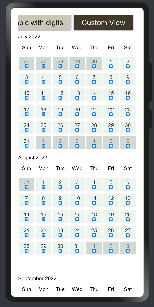

# Times Square
****
Times Square helps you to pick and customize calendar with multiple attributes and support for Arabic calendar 
## Dependencies
****
For using Times Square in your app, add the below dependency in the entry/package.json  
```
"dependencies": {
    "@ohos/times_square": "file:../times_square"
  }
```
Add dependency command with
```
npm i @ohos/times_square
```
## Usage instructions
****
Import all components at once
```
import { CalendarMainModel } from '@ohos/times_square'
```
## Screenshots
****








## How to use it
### Imports
Import the following
```
import { CalendarMainModel } from '@ohos/times_square'
```
### Code
To use the calendar dependency
```
CalendarMainModel({
          tsTypeOfCalendar: Type of Calendar [Single|Multi|Range],
          tsBgColor: Calendar background color,
          tsGridTextSize: Calendar grid text size,
          tsMonthTextSize:  Calendar month text size,
          tsMonthTextColor: Calendar month text color,
          tsSelectedTextColor: Calendar selected text color,
          tsSelectedGridBackgroundColor: Calendar selected grid background color,
          tsNotInMonthTextColor: Calendar not in month text color,
          tsInMonthColor: Calendar in month text color,
          tsNotInMonthColor: Calendar grid not in month color,
          tsInMonthTextColor: Calendar grid in month color,
          tsSetSelection: Setting selection,
          tsWithNumbers: Display numbers [For arabic only],
          tsLanguage: [English|Arabic],
          tsGridShape: Calendar grid shape [Square|Circle],
```

## Styling
****
You can style the Calendar  using theses attributes :

| Attribute | Description |
| -------- | ----------- |
|tsTypeOfCalendar|Type of the calendar|
|tsBgColor|Background color of the calendar|
|tsGridTextSize|Calendar grid text size|
|tsMonthTextSize|Calendar month text size|
|tsMonthTextColor|calendar month text color|
|tsSelectedTextColor|Calendar selected date text color|
|tsSelectedGridBackgroundColor|Calendar selected date background color|
|tsNotInMonthTextColor|Calendar not in month text color|
|tsInMonthColor|Calendar in month text color|
|tsNotInMonthColor|Calendar not in month background color|
|tsInMonthTextColor|Calendar in month background color|
|tsSetSelection|Calendar setting for selection|
|tsWithNumbers|Calendar to show numbers (For arabic)|
|tsLanguage|Calendar set language|
|tsGridShape|Calendar grid shape|
|tsDayIcon|Calendar grid icon|

## Compatibility
****
Supports OpenHarmony API version 9
## Code Contribution
****
If you find any problems during usage, you can submit an [issue](https://github.com/satvikshubham/BusinessHoursPicker/issues/new/choose) to us. Of course, we also welcome you to send us PR.
## Open source License
****
This project is based on [Apache License 2.0](./LICENSE), please enjoy and participate in open source freely.
